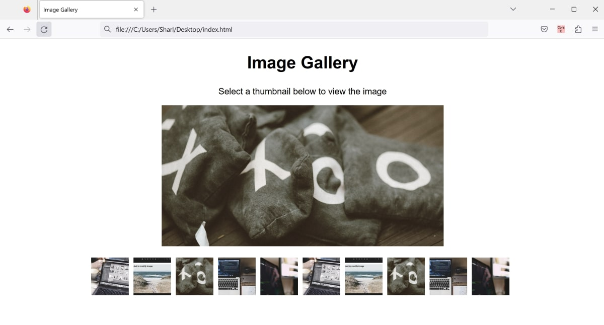

# js-image-gallery
This is an example project on how to make an image gallery using HTML, CSS, and JavaScript

The project consists of:
* index.html - Simple HTML page to open in a browser
* styles.css - Styling for the HTML page.
* script.js - Functionality for the image gallery.

## To Run

* Click on the index.html file to open it in a web browser. Click through the different thumbnails at the bottom to preview the image.

## Example

